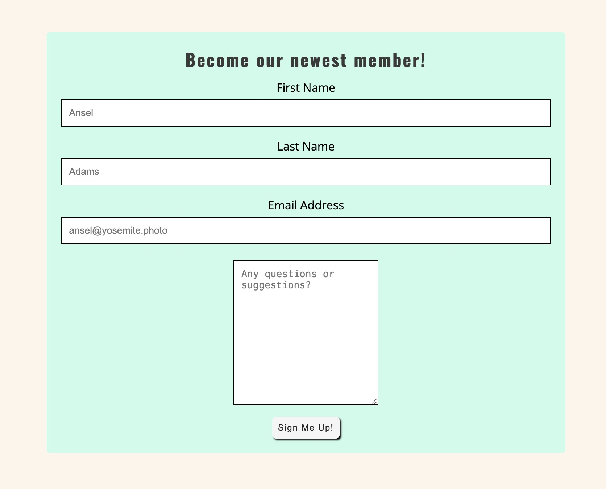
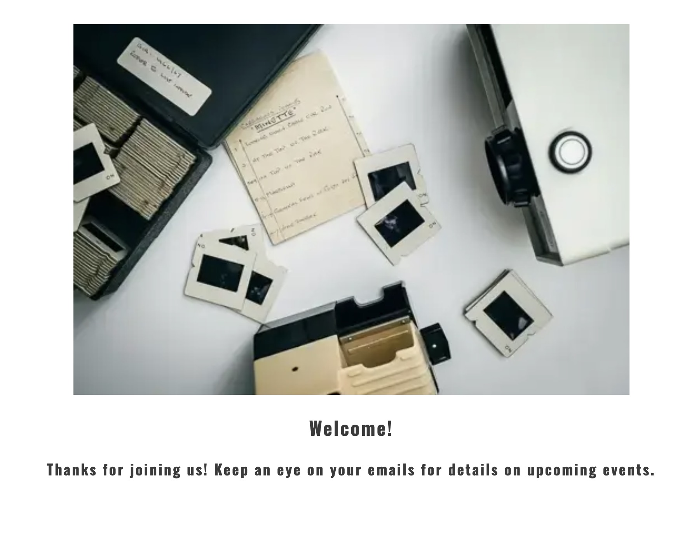
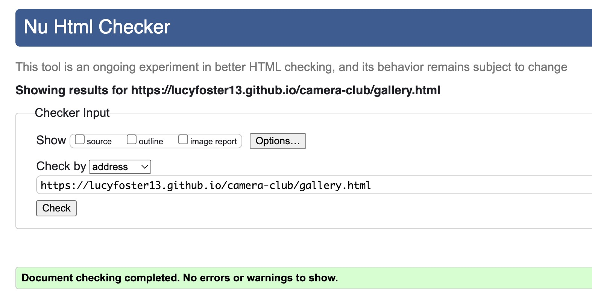

# Camera Club

Camera Club is a webiste to advertise and promote a fictional photography meetup group. Users can learn about the ethos of the group, the kinds of events that take place, view images from past events and sign up to become a member.


## Features 

### Existing Features

* Navigation Bar
    * Featured on all three pages, the navigation bar contains links to the Home, Gallery and Signup pages and is responsive on all devices. On smaller screens, a burger icon can be clicked to reveal the menu in dropdown format.
    * Allows users to easily navigate between all pages on the site. The dropdown menu on smaller-screened devices allows for a cleaner, neater design. 
    

* Landing page image
    * The landing includes a hero image of several analog film cameras, with a call-to-action button positioned in the middle.
    * This section immediately grabs the user's eye and shows them what the topic of the page is. The "Become a Member" call-to-action button immediately informs the user that this is some sort of club and, if clicked, will bring them directly to the signup page.
    

* About Camera Club Section
    * The About Camera Club section allows the user to learn more about the ethos of the club and the kind of events they can look forward to.
    * This section will assure the user that all are welcome to join the club, that they do not need to have any prior photography experience, and that as a member they can enjoy plenty of social and educational gatherings.
    

* Invitation to jump to gallery
    * This section invites the user to view photos of past events with a button that takes them directly to the gallery page.
    * This feature makes it easy for the user to jump straight to the gallery to view photos of past events, having just read about them.
    

* Footer
    * The footer section includes the club's phone number, email adress and links to social media pages. The phone number and the email address contain clickable links that will open the device's native phone and email apps. The social media icons are all clickable links too, which open in a new tab.
    * The footer allows the user to stay connected, in whatever way suits them best, with just one easy click.
    

* Gallery
    * The gallery page provides the user with a visual guide to the different kinds of events hosted by the club.
    * The gallery is valuable to the user as they will be able to get a feel for the types of events and meetups they can go to if they become a member. They will see that there is a varied mix of ages, genders and ethnicites and that the events range from informal dinners to more structured talks.
    

* SignUp Page
    * This page provides the user with a straight-forward form to get signed up as a member. The user will be required to submit their full name and email address in order to submit the form. There is also a text box for the user to include an optional message to the organisers. 
    * This allows the user to quickly and easily become a member of the club. It also allows them to ask a question or write a message to the organisers, if they wish.
    

* Thank You Page
    * On successful submission of the signup form, the user will be redirected to a page welcoming them to the club and thanking them for becoming a member.
    * This features shows the user that they are welcomed and appreciated. It also makes it clear that their membership has been received.
    

* 404 Page
    * A custom 404 page will display if the user naviagtes to a broken link.
    * The 404 page will allow the user to easily navigate back to the website using all of the links in the header and footer, as well as a button that will bring them to the homepage.
    

### Features Left to Implement
    * As a future enhancement, another feature could be added on the Home Page, under the About Camera Club section. This feature would include a feature that gives more specific details on the three main kinds of events run by the club: photo walks, casual social gatherings, and formal talks and portfolio reviews. Each section would have a clickable link to the corresponding section on the gallery page, allowing the user to jump directly to specific event photos.

## Testing 

### Responsiveness

All pages were tested to ensure responsiveness on screen sizes from 280px and upwards on Chrome, Safari, Firefox and Opera browsers.

Steps to test:

1. Open browser and navigate to [Camera Club](https://lucyfoster13.github.io/camera-club/)
2. Open the developer tools (right click and inspect)
3. Set to responsive and decrease width to 280px or "Galaxy Fold"
4. Set the zoom to 50%
5. Click and drag the responsive window to maximum width

Expected:

Website is responsive on all screen sizes and no images are pixelated or stretched.
No horizontal scroll is present.
No elements overlap.

Actual:

Website behaved as expected.

Website was also opened on the following devices and no responsive issues were found:

- Apple iPhone 12 Pro
- Apple iPhone 15 Pro Max
- Samsung Galaxy S10
- Amazon Fire HD 8 Tablet
- Apple iPad Pro
- Apple Macbook Pro

### Accessibility

[Wave Accessibility](https://wave.webaim.org/) tool was used throughout development and for final testing of the deployed website to check for any aid accessibility testing.

Testing was focused to ensure the following criteria were met:

- All forms have associated labels or aria-labels so that they can be read aloud by a screen reader
- Colours used on the site are suitably contrasted and don't cause any readability issues for visually impaired users
- Heading levels are not skipped, ensuring each section of content's importance is relayed correctly to the end user
- All content is contained within landmarks to ensure ease of use for assistive technology, allowing the user to navigate by page regions
- All images and icons have alternative text or titles so descriptions can be communicated. via screen readers
- HTML page lang attribute has been set
- Aria properties have been implemented correctly

Found Issue: The toggle icon for the dropdown menu in the navigation bar was not correctly labelled for screen readers.
Fix: A span with added with text explaining the function of the feature. The text was then styled to be visible only to a screen-reader.

### Lighthouse Testing


### Functional Testing

- Testing was performed to ensure all navigation links redirected to the correct pages as per design. This was done by clicking on the navigation links on each page.
- The form on the signup page was tested to ensure it functioned as expected when all required data was entered and when any required data was omitted.
- Testing was performed on the Font Awesome icons and contact links in the footer to ensure that each one opened in a new tab and that each one had the correct purple hover effect.

In all scenarios, the functions behaved as expected.

### Validator Testing

* HTML
  * No errors were returned when passing through the official [W3C validator](https://validator.w3.org)





* CSS
    * No errors were found when passing through the official [(Jigsaw) validator](https://jigsaw.w3.org)


## Technologies
* HTML
    * The structure of the website was developed using HTML as the main language.
* CSS
    * The website was styled using custom CSS in an external file.
* Gitpod
    * The website was developed using Gitpod IDE.
* GitHub
    * Source code is hosted on GitHub and deployed using Git Pages.
* Git 
    * Used to commit and push code during the development of the website.
* Google Fonts
    * The fonts used throughout the website were obtained from https://fonts.google.com/.
* Font Awesome
    * Icons obtained from https://fontawesome.com/ were used as the Social media links in the footer section and the navigation bar dropdown toggle for smaller screens. 
* Adobe Lightroom
    * Adobe Lightroom was used for resizing images and editing photos for the website.    
* Convertio & WebP Converter
    * https://convertio.co/ and https://www.freeconvert.com/webp-converter were used to convert image files from jpg to webp.  
* TinyJPG & TinyPNG
    * https://tinyjpg.com/ and https://tinypng.com/ were used to reduce the size of the images used throughout the website
* Favicon.io
    * The website's favicon was downloaded from https://favicon.io/favicon-converter/ 

## Deployment

### Version Control

The site was created using the Gitpod code editor and pushed to github to the remote repository ‘camera-club’.

The following git commands were used throughout development to push code to the remote repo:

```git add . ``` - This command was used to add any modifications to the staging area before they were committed.

```git commit -m “commit message”``` - This command was used to commit changes to the local repository queue, ready for the final step.

```git push``` - This command was used to push all committed code to the remote repository on github.

### Deployment to Github Pages

- The site was deployed to GitHub pages. The steps to deploy are as follows: 
  - In the GitHub repository, navigate to the Settings tab 
  - From the menu on left select 'Pages'
  - From the source section drop-down menu, select the Branch: main
  - Click 'Save'
  - A live link will be displayed in a green banner when published successfully. 

The live link can be found here - https://lucyfoster13.github.io/camera-club/

### Clone the Repository Code Locally

Navigate to the GitHub Repository you want to clone to use locally:

- Click on the code drop down button
- Click on HTTPS
- Copy the repository link to the clipboard
- Open your IDE of choice (git must be installed for the next steps)
- Type git clone copied-git-url into the IDE terminal

The project will have been cloned on your local machine and be ready to use. 

## Credits 

### Content 
* The addition of the club's phone number and email address as clickable links that open the user's native phone and/or email app was inspired by my mentor Gareth McGirr's site: https://gareth-mcgirr.github.io/tacos-travels/ 
* All text content on the site was written by the developer and is entirely fabricated.


### Code
* Code to add links that open the phone app and email app when clicked: https://tinyurl.com/campaignmonitortutorial.
* Code to place the call-to-action button in the center of the landing image: https://www.w3schools.com/howto/howto_css_button_on_image.asp.
* Code to add redirection link to buttons: https://tinyurl.com/button-redirect
* Code to add visually-hidden text for screen-readers: https://tinyurl.com/visually-hidden-text

### Media 
* All images were downloaded from [Unsplash](https://unsplash.com) and [Pexels](https://www.pexels.com/).